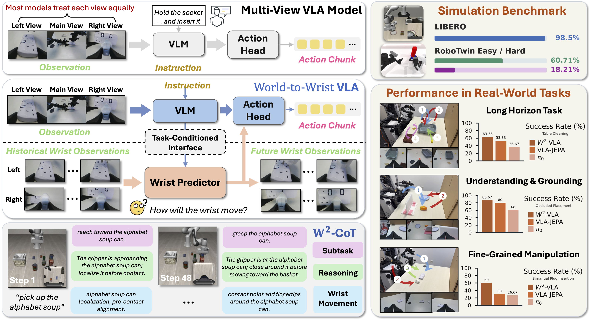

<div align="center">

# W²-VLA

***World-to-Wrist***<br>
**Task-Conditioned Future Wrist Modeling**<br>
**for Fine-Grained Robot Manipulation**

<a href="https://arxiv.org/abs/2608.05369"></a>
<a href="https://yyyyu120.github.io/W2-VLA/"></a>
<a href="https://huggingface.co/datasets/yuuu94/W2-VLA-CoT"></a>
<a href="https://huggingface.co/datasets/yuuu94/W2-VLA-Training-Data"></a>

W²-VLA combines a Qwen3-VL world branch, a frozen V-JEPA2.1 wrist encoder,
future-wrist latent prediction, and a DiT action head. The same codebase
supports LIBERO, RoboTwin, and real-world LeRobot datasets.



</div>

## 🔍 Overview

W²-VLA uses offline chain-of-thought (CoT) text to shape implicit modeling
tokens during training. The VLM predicts the CoT target under teacher forcing,
while the teacher-forced answer is excluded from the action context. At
inference time, the policy directly uses the modeling-token states and does not
autoregressively generate reasoning text.

In parallel, a frozen V-JEPA2.1 encoder maps historical wrist observations to
spatiotemporal latents. A trainable predictor forecasts future wrist latents,
which are compressed and passed to the DiT action head together with the VLM
context.

| Setting | Action space | Training configuration |
| --- | --- | --- |
| LIBERO | 7-D delta joint position | `subtask_m2w_libero_w2.yaml` |
| RoboTwin | 14-D absolute joint position | `subtask_m2w_robotwin_w2.yaml` |
| Real world | Dataset-specific joint action | Task-specific wrapper |

> Some internal modules retain the historical `M2W` identifier for checkpoint
> compatibility. The public project name is W²-VLA.

## 🔧 Installation

The reference environment uses Linux, Python 3.10, CUDA, and an NVIDIA GPU
with BF16 support.

```bash
sudo apt-get install -y git git-lfs ffmpeg build-essential ninja-build
git lfs install

git clone https://github.com/yyyyu120/W2-VLA.git
cd W2-VLA

conda create -n w2-vla python=3.10 -y
conda activate w2-vla

# Required by the pinned DeepSpeed build when no system CUDA toolkit is present.
conda install -c nvidia cuda-nvcc=12.4 -y

python -m pip install --upgrade pip setuptools wheel
python -m pip install \
  torch==2.6.0 torchvision==0.21.0 \
  --index-url https://download.pytorch.org/whl/cu124
python -m pip install -r requirements.txt
python -m pip install -e .
```

On systems without `sudo`, install the command-line video tools with
`conda install -c conda-forge ffmpeg -y` instead of `apt-get`.

Use mutually compatible PyTorch, torchvision, and CUDA builds on other GPU
platforms. W²-VLA uses PyTorch SDPA by default. Distributed training uses the
provided DeepSpeed ZeRO-2 BF16 configuration.

Keep the LIBERO and RoboTwin simulators in separate environments from the
W²-VLA training environment.

## 🚀 Quick Start

After preparing the assets described below, start a four-GPU RoboTwin run with:

```bash
CUDA_VISIBLE_DEVICES=0,1,2,3 \
NUM_PROCESSES=4 \
PER_DEVICE_BATCH_SIZE=16 \
DATA_ROOT_DIR=$PWD/playground/Datasets/W2-VLA-Training-Data/robotwin \
SUBTASK_LABEL_DIR=$PWD/playground/Datasets/W2-VLA-CoT/robotwin \
BASE_VLM=$PWD/playground/Pretrained_models/Qwen3-VL-4B-Instruct \
RUN_ID=w2_vla_robotwin_h16 \
WANDB_MODE=offline \
bash scripts/train_subtask_m2w_deepspeed.sh \
  starVLA/config/training/subtask_m2w_robotwin_w2.yaml
```

The effective global batch size is:

```text
number of processes × per-device batch size × gradient accumulation steps
```

For a low-cost pipeline check, set `PER_DEVICE_BATCH_SIZE=1`. Full-parameter
Qwen3-VL-4B training may still require multiple GPUs because AdamW optimizer
states consume substantially more memory than a forward pass.

## 📦 Assets

Store downloaded datasets, offline CoT labels, and pretrained backbones under
`playground/`:

```text
playground/
├── Datasets/
│   ├── W2-VLA-Training-Data/
│   │   ├── libero/
│   │   ├── robotwin/
│   │   └── real_world/
│   └── W2-VLA-CoT/
│       ├── libero/
│       ├── robotwin/
│       └── real_world/
└── Pretrained_models/
    ├── Qwen3-VL-4B-Instruct/
    ├── VJEPA2.1/
    ├── torch_hub/
    └── <policy-run>/
        ├── config.yaml
        ├── dataset_statistics.json
        └── checkpoints/
            └── steps_<N>_pytorch_model.pt
```

### Pretrained Backbones

| Backbone | Official source |
| --- | --- |
| Qwen3-VL-4B-Instruct | [Qwen/Qwen3-VL-4B-Instruct](https://huggingface.co/Qwen/Qwen3-VL-4B-Instruct) |
| V-JEPA2.1 ViT-L/384 | [Meta V-JEPA2](https://github.com/facebookresearch/vjepa2) and its [checkpoint](https://dl.fbaipublicfiles.com/vjepa2/vjepa2_1_vitl_dist_vitG_384.pt) |

Download the backbones with:

```bash
python -m pip install -U huggingface_hub

# Optional on networks that require a Hugging Face mirror:
# export HF_ENDPOINT=https://hf-mirror.com

hf download Qwen/Qwen3-VL-4B-Instruct \
  --local-dir playground/Pretrained_models/Qwen3-VL-4B-Instruct

export TORCH_HOME=$PWD/playground/Pretrained_models/torch_hub

bash scripts/download_vjepa2_1_checkpoint.sh \
  large playground/Pretrained_models/VJEPA2.1
```

V-JEPA2.1 remains frozen during training.

### LeRobot Training Data

The action-data release contains the complete LeRobot datasets paired with the
offline CoT annotations: four LIBERO suites, 50 clean RoboTwin tasks, and four
real-world tasks. Every suite or task is directly expanded with its `meta/`,
`data/`, and `videos/` directories.

```bash
W2_DATA_REPO=yuuu94/W2-VLA-Training-Data

hf download "$W2_DATA_REPO" \
  --repo-type dataset \
  --local-dir playground/Datasets/W2-VLA-Training-Data
```

The release contains 58 directly usable LeRobot datasets with 4,573 episodes
and 1,043,400 frames. No additional extraction step is required.

### Offline CoT Labels

Offline CoT labels are frame-aligned `.npz` annotations generated before
policy training. The release covers LIBERO, RoboTwin, and four real-world
tasks. The preferred `cot_train_text` field follows:

```text
Subtask: ...
Reasoning: ...
Wrist: ...
```

Download the unified label release into `playground/Datasets/`:

```bash
W2_LABEL_REPO=yuuu94/W2-VLA-CoT

hf download "$W2_LABEL_REPO" \
  --repo-type dataset \
  --local-dir playground/Datasets/W2-VLA-CoT
```

Use `W2-VLA-CoT/libero`, `W2-VLA-CoT/robotwin`, or
`W2-VLA-CoT/real_world` as the label root for the corresponding setting. No
offline CoT label is loaded at inference time. See [Datasets](docs/DATASETS.md)
and [Training pipeline](scripts/README_W2_PIPELINE.md) for details.

## 🏋️ Training

### LIBERO

Prepare the LeRobot data, then launch distributed training:

```bash
CUDA_VISIBLE_DEVICES=0,1,2,3 \
NUM_PROCESSES=4 \
PER_DEVICE_BATCH_SIZE=16 \
DATA_ROOT_DIR=$PWD/playground/Datasets/W2-VLA-Training-Data/libero \
SUBTASK_LABEL_DIR=$PWD/playground/Datasets/W2-VLA-CoT/libero \
BASE_VLM=$PWD/playground/Pretrained_models/Qwen3-VL-4B-Instruct \
RUN_ID=w2_vla_libero \
WANDB_MODE=offline \
bash scripts/train_subtask_m2w_deepspeed.sh \
  starVLA/config/training/subtask_m2w_libero_w2.yaml
```

### RoboTwin

Place the 50 clean LeRobot tasks at
`playground/Datasets/W2-VLA-Training-Data/robotwin/<task-name>/`, then run:

```bash
CUDA_VISIBLE_DEVICES=0,1,2,3 \
NUM_PROCESSES=4 \
PER_DEVICE_BATCH_SIZE=16 \
GRADIENT_ACCUMULATION_STEPS=1 \
DATA_ROOT_DIR=$PWD/playground/Datasets/W2-VLA-Training-Data/robotwin \
SUBTASK_LABEL_DIR=$PWD/playground/Datasets/W2-VLA-CoT/robotwin \
BASE_VLM=$PWD/playground/Pretrained_models/Qwen3-VL-4B-Instruct \
RUN_ID=w2_vla_robotwin_h16 \
WANDB_MODE=offline \
bash scripts/train_subtask_m2w_deepspeed.sh \
  starVLA/config/training/subtask_m2w_robotwin_w2.yaml
```

The default RoboTwin setup uses a 16-step absolute-action chunk, 16 fixed query
slots with trainable token embeddings, two wrist views, and eight historical
wrist frames. Their contextualized hidden states vary with the observation and
instruction.

### Real World

Convert each task to LeRobot format, register its data mixture, and launch the
matching task wrapper. For example:

```bash
CUDA_VISIBLE_DEVICES=0,1,2,3 \
NUM_PROCESSES=4 \
PER_DEVICE_BATCH_SIZE=12 \
NUM_WORKERS=1 \
PREFETCH_FACTOR=1 \
VIDEO_BACKEND=pyav \
DATA_ROOT_DIR=$PWD/playground/Datasets/W2-VLA-Training-Data/real_world \
SUBTASK_LABEL_DIR=$PWD/playground/Datasets/W2-VLA-CoT/real_world \
MAX_TRAIN_STEPS=100000 \
NUM_WARMUP_STEPS=1000 \
SAVE_INTERVAL=2000 \
RUN_ID=w2_vla_realworld_task \
WANDB_MODE=offline \
bash scripts/train_subtask_m2w_realworld_table_clean_deepspeed.sh
```

<details>
<summary>Available real-world task wrappers</summary>

```text
scripts/train_subtask_m2w_realworld_place_bag_deepspeed.sh
scripts/train_subtask_m2w_realworld_put_mango_deepspeed.sh
scripts/train_subtask_m2w_realworld_table_clean_deepspeed.sh
scripts/train_subtask_m2w_realworld_plug_in_socket_deepspeed.sh
```

</details>

## 📊 Evaluation

Evaluation requires a complete policy run directory containing the checkpoint,
`config.yaml`, and `dataset_statistics.json`.

### LIBERO

Start the policy server in the W²-VLA environment:

```bash
GPU_ID=0 \
PORT=6694 \
CKPT=$PWD/playground/Pretrained_models/W2-VLA-LIBERO/checkpoints/steps_<N>_pytorch_model.pt \
bash examples/LIBERO/eval_files/run_policy_server.sh
```

Run the client in the LIBERO environment:

```bash
LIBERO_HOME=/path/to/LIBERO \
PORT=6694 \
TASK_SUITE_NAME=libero_10 \
NUM_TRIALS_PER_TASK=20 \
SAVE_VIDEO=0 \
CKPT=$PWD/playground/Pretrained_models/W2-VLA-LIBERO/checkpoints/steps_<N>_pytorch_model.pt \
bash examples/LIBERO/eval_files/eval_libero.sh
```

### RoboTwin

Set the policy and simulator interpreters, then evaluate a task:

```bash
export ROBOTWIN_PATH=/path/to/RoboTwin-Platform
export STARVLA_PYTHON=/path/to/w2-vla-env/bin/python
export ROBOTWIN_PYTHON=/path/to/robotwin-env/bin/python

ROBOTWIN_TEST_NUM=100 \
ROBOTWIN_EVAL_VIDEO_LOG=False \
ROBOTWIN_FLOW_INFERENCE_STEPS=8 \
CUDA_VISIBLE_DEVICES=0 \
bash examples/Robotwin/eval_files/start_eval.sh \
  -m demo_clean \
  -n w2_vla_robotwin_eval \
  -c $PWD/playground/Pretrained_models/W2-VLA-RoboTwin/checkpoints/steps_<N>_pytorch_model.pt \
  -s 0 \
  -j 1 \
  -p 6794 \
  adjust_bottle
```

Use `demo_randomized` for randomized-scene evaluation.

## 📖 Documentation

- [Data and checkpoints](docs/DATA_AND_CHECKPOINTS.md)
- [Datasets](docs/DATASETS.md)
- [Training scripts](scripts/README.md)
- [Training pipeline](scripts/README_W2_PIPELINE.md)
- [LIBERO](examples/LIBERO/README.md)
- [RoboTwin](examples/Robotwin/README.md)

## 🤝 Citation

```bibtex
@misc{pan2026worldtowristtaskconditionedfuturewrist,
  title        = {World-to-Wrist: Task-Conditioned Future Wrist Modeling for Fine-Grained Robot Manipulation},
  author       = {Yuhao Pan and Haosong Peng and Zhengshen Zhang and Zhengyang Yan and Yalun Dai and Fushuo Huo and Chujie Wang and Tianyu Qi and Xiucheng Wang and Nan Cheng and Wenchao Xu},
  year         = {2026},
  eprint       = {2608.05369},
  archivePrefix = {arXiv},
  primaryClass = {cs.RO},
  url          = {https://arxiv.org/abs/2608.05369}
}
```

## 🙏 Acknowledgements

W²-VLA builds on StarVLA and uses Qwen3-VL, V-JEPA2.1, LeRobot, LIBERO,
RoboTwin, and DeepSpeed, deployed on RTC-Anything.
See [NOTICE.md](NOTICE.md) for attribution.

## 📄 License

See [LICENSE](LICENSE).
